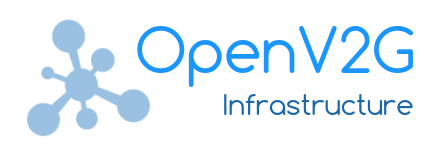

# 
Base for all OpenV2G components

[Project Home](https://github.com/OpenV2G)

## Features
- **PKIs:** Provides PKIs for all roles in V2G.
- **REST APIs:** Connect OpenV2G to existing systems.
- **Modular:** Modules for all roles can be operated separately.

## Table of Contents
1. [Motivation](#motivation)
1. [Links](#links)
1. [Scope](#scope)
1. [Architectual Overview](#architectual-overview)
1. [FAQ](#faq)
1. [Contribution](#contribution)

# Motivation

Plug and Charge has the potential to provide great advantages in tearms of
technical features and convenience for the user. This can be seen as a addon
to the current market mechanisms and a upgrade to current user experience.
All market roles, however have to implement the crypto mechanisms defined by
the ISO/IEC 15118, deal with PKIs and handle certificates.

These common tasks can be provided by an open source implementation without
influencing each parties market differentiation. A common implementation
helps to develop the ecosystem more quickly, making more roaming partners
available to those who want to use Plug and Charge. 

# Scope

This project will implement all necessary components of the V2G PKI
infrastructure. However, since some of these components require an
active link to a charging station or an electric vehicle, some parts
will be implemented as mockup services to simulate these hardware
components. The focus lies on the PKIs rather than on the
_ISO/IEC 15118_ interface between car and infrastructure.

For the project scopes on the individual roles see
[/doc/roles-and-systems-list.csv](doc/roles-and-systems-list.csv).

# Architectual Overview

# Links

Links to related projects and resources:

 * **[V2G Clarity's RISE-V2G](https://github.com/V2GClarity/RISE-V2G)** _The only fully-featured reference implementation of the Vehicle-2-Grid communication interface ISO 15118_
 * **[ISO 15118 User Group](http://extmgmt.kn.e-technik.tu-dortmund.de/)** _Join the ISO 15118 User Group for discussing Q&As regarding the implementation of ISO 15118 standard requirements_
 * **[ISO 15118](https://www.iso.org/standard/55366.html)** _ISO 15118-2:2014 Road vehicles -- Vehicle-to-Grid Communication Interface -- Part 2: Network and application protocol requirements_

# FAQ

## Who can use this project?

All parties who implement a PnC market role.

## How can I contribute?

See [contribution](#contribution).

## Will all roles get implemented within OpenV2G?

There will pobably never be a implementation for the EV and the EVSE itself. There are other projects available which provide this functionality.

## Where can I read about Plug and Charge itself?

Plug and Charge is defined by the _ISO/IEC 15118_ standard which you would need to buy.

## Are there other resources to learn about Plug and Charge?

See the [links](#links) section. There is also [v2g-clarity.com](http://v2g-clarity.com) which provides free and paid information.

# Contribution

The OpenV2G implementation is under development.

We would therefore appreciate  your help in pushing the development forward.

If you would like to see a feature implemented or want to contribute a new
feature, you are welcome to open an issue to discuss it and we will be more than
happy to help.

If you choose to make a contribution, please fork this repository, work on a
feature and submit a pull request. cote is the next level of microservices —
be part of the revolution.

